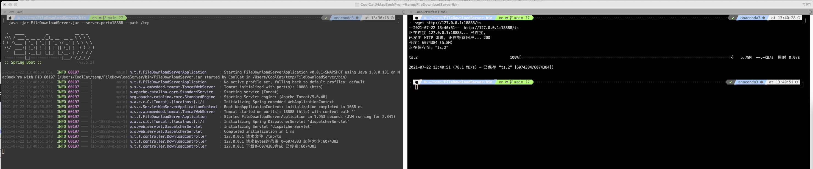

# FileDownloadServer

一个可以查看文件传输进度的Web项目

### 0x01 使用

```
> # 设置Web端口为18888,可请求的文件路径为/tmp目录
> java -jar FileDownloadServer.jar --server.port=18888 --path /tmp
```

其中`server.port`参数默认值为8848,`path`参数默认值为当前路径


### 0x02 功能

* 支持在服务端显示文件传输的状态。
* 支持断点续传。
